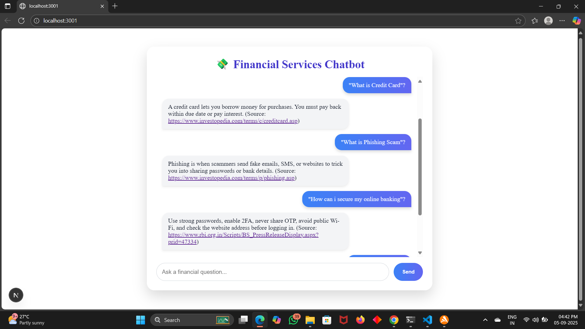

# 💸 Financial Services Chatbot

A web-based chatbot that provides answers to financial questions using HuggingFace FinancialBERT model.

## Features
- Ask financial questions like "What is IMPS?" or "What is credit card?"
- Bot gives instant answers with source references.
- Beautiful and responsive UI using Next.js and Tailwind CSS.


## 🚀 Live Demo
🔗 [Click here to use the chatbot](https://financial-services-chatbot.vercel.app)


## 🖼 Screenshot

  <!-- Replace with actual screenshot file path -->

## 🛠 Tech Stack
- React + Node.js
- HuggingFace FinancialBERT
- Tailwind CSS
- Vercel (Deployment)

## 📌 How to Run Locally
```bash
git clone https://github.com/NikitaCKyatanavar/financial-services-chatbot.git
cd financial-llm-chatbot-complete
npm install
npm run dev


